# Godot Gravity Fields
### ***The code is in addons/gravityfields, any other code is for tests***

### ***For easy installation the addon's zip is in the release section***

### ***⚠️ Only works on 4.5 and later versions***

## What is it ?
This plugin's aim is to provide an easy way to create custom gravity similar to the ones you can find in games like Super Mario Galaxy in Godot. It is designed to be easy to use and flexible, allowing you to create a wide variety of gravity fields with different shapes and behaviors.

## What you can do
Here is a list of demos :

Directional Gravity

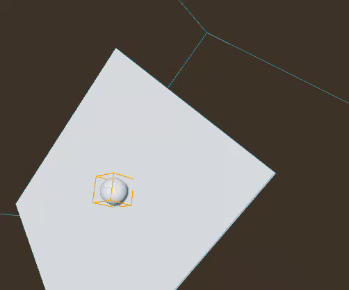

Sphere Gravity

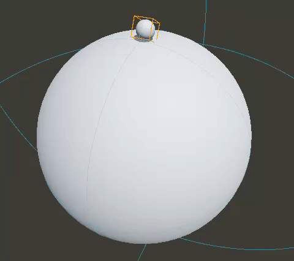

Pill shaped gravity

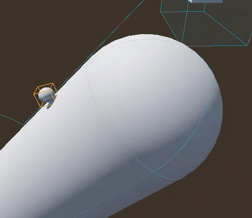

Pyramid shaped gravity

Gravity current

Other shapes

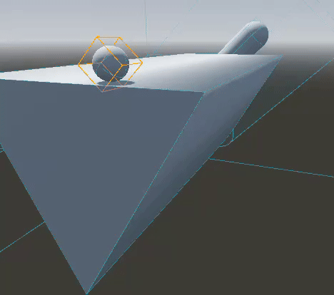

## Editor helpers
Included with the plugin are some gizmos to help you see the gravity fields in the editor. Also, to help visualize the effect of the gravity on objects, I created particles that are influenced by the gravity fields. I also created a static arrow field node that can help visually see the gravity.

#### ⚠️ To use these visualizations nodes, you will need to install the [debug draw 3d](https://github.com/DmitriySalnikov/godot_debug_draw_3d) addon. It is used to display the particles on screen

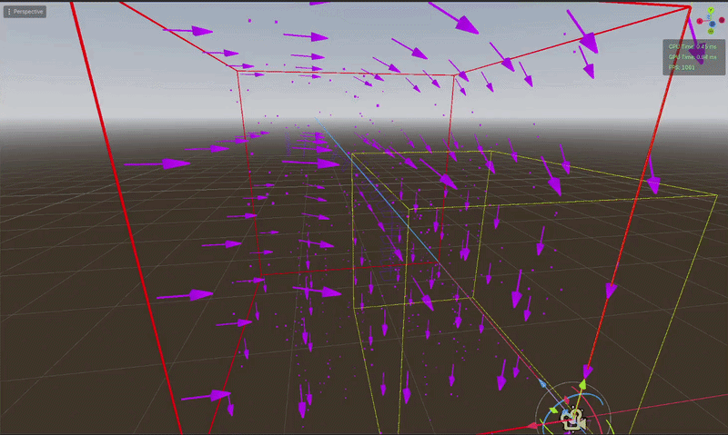

# How to use

### Word definitions
- **Provider**: Node that returns the gravity applied to the body
- **Detector**: Area3D detecting body entering and assigning a Provider to it
- **GravityBody**: RigidBody3D affected by the gravity fields

## GravityBody3D & GravityCharacter3D
- If you already have a character controller using RigidBody3D, you can simply change the node's type and it should work.
- Set the base gravity scale to zero to only be affected by the custom gravity fields.
- You can call `get_custom_gravity` instead of `get_gravity` to get the applied gravity.
- The gravity is applied in the `_integrate_forces` function, so it should work with any character controller that uses that function to apply gravity.
- The GravityCharacter3D is just a CharacterBody3D with the `get_custom_gravity` mechanics. You will need to apply the gravity yourself in a way you see fit.

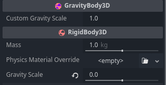

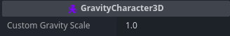

## Detectors
- The **GravityDetector3D** is an **Area3D** that will asign its gravity provider to an entering **GravityBody3D**.
- Enabling the `Space Override` in the gravity section is necessary to apply the gravity.
- You can also set a priority to the detector, which will be used when multiple detectors are affecting the same body.
- You can set the detector to only affect certain groups; you can use a whitelist or a blacklist to filter the groups that will be affected by the detector.

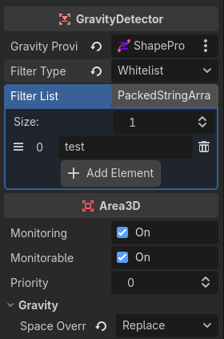

## Providers
- Abstract class that returns the gravity applied at a point in space
- You can create your own providers by extending the **GravityProvider3D** class and implementing the `get_custom_gravity(globalBodyPosition : Vector3) -> Vector3` function.
- You can set a gravity falloff curve to make the gravity stronger or weaker depending on the distance from the provider. The curve is evaluated with the distance from the body to the provider as input, so you can make it so the closer you are from an object the stronger its gravity will be. Play with the values, the possibilities are endless!
- You can set the force of the gravity, call the `get_custom_gravity` to get the Vector of the gravity at a point in space.

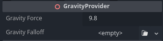

### Directional Provider
- The gravity is applied in a specific direction, regardless of the position of the body.

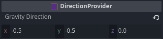

### Sphere Provider
- The gravity applied will pull the body towards the provider, as if the provider was a planet.

### Shape Provider
- The gravity applied to the body will be calculated with the position of the body relative to the nearest point on the curve.
- You can set the number of "faces" your path will have.
    - For example, with no faces, the "shape" of the gravity will be like a pill.
    - If you have "faces", the "shape" of the gravity could look like a Prism.
- The "Peak" option allows you to make pyramids & cones, the tilt of the gravity depends on the height and radius values.
    - A height and a radius of 5 will make a 45 degrees angle.
    - For the ["gravity current"](#what-you-can-do) you just need to set the height to any number and the radius to 0.

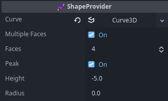