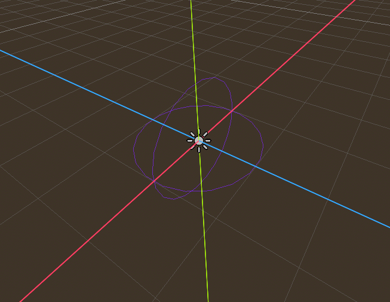

# Godot Gravity Fields
### ***The code is in addons/gravityfields, any other code is for tests***

### ***For easy installation the addon's zip is in the release section***

### ***⚠️ Only works on 4.5 for now***

## What is it ?
It's an addon allowing you to easily implement custom gravity into your game.
You can create different zones with their own gravity that will affect the player.

The goal is to be able to make gravity zones just like in Mario Galaxy

## What you can do
Here is a list of demos :

Directional Gravity

Sphere Gravity

Pill shaped gravity

Pyramid shaped gravity

Gravity current

Other shapes

## How does it work
Before going into it, here's words and definitions:
- Provider -> Node that returns the gravity applied to the body
- Detector -> Area3D detecting body entering and asigning a Provider to it
- GravityBody -> a RigidBody

### GravityBody3D & GravityCharacter3D

The GravityBody3D is a RigidBody3D that can be influenced by our custom gravity. If you don't set the base gravity scale to zero, the body will be influenced by both the custom and the project's gravity. Call `get_custom_gravity` instead of `get_gravity` to get the applied gravity.

The GravityCharacter3D is just a CharacterBody3D with the `get_custom_gravity` mechanics. Use it as you see fit.

### GravityDetector3D

The GravityDetector3D is an Area3D that will asign its gravity provider to an entering GravityBody3D. Enabling the space override in the gravity section is necessary to apply the gravity.

### GravityProvider (abstract)

You can set gravity falloff with a curve. You can make so the closer you are from an object the stronger its gravity will be. Play with the values, the possibilities are endless!

You can set the force of the gravity, call the `get_custom_gravity` to get the Vector of the gravity.

#### DirectionProvider

This is used for flat surfaces. the same gravity will be applied everywhere, you just set the direction of it.

#### SphereProvider

The gravity applied will be like one of a planet.

#### ShapeProvider

The gravity applied to the body will be calculated with the position of the body relative to the nearest point on the curve. You can set the force of the gravity and chose the number of "faces" your path will have. For example, with no faces, the "shape" of the gravity will be like a pill. If you have "faces", the "shape" of the gravity could look like [this](#gpath3d). The "Peak" option allows you to make pyramids & cones, the tilt of the gravity depends on the height and radius values. A height and a radius of 5 will make a 45 degrees angle. For the "gravity curren" you just need to set the height to any number and the radius to 0.

## Custom Gizmo
You will also have a custom gizmo for each GravityProvider

### ShapeProviderGizmo

### SphereProviderGizmo

### DirectionProviderGizmo

## Custom Physics Particles

Normal Particles in godot can't be affected by in-game gravity so I made my own particles. This option is very limited but is very usefull in the editor for figuring out how the gravity is behaving.

### ⚠️ To use this node, you will need to install the [debug draw 3d](https://github.com/DmitriySalnikov/godot_debug_draw_3d) addon (tested with 1.5.1). It is used to display the particles on screen